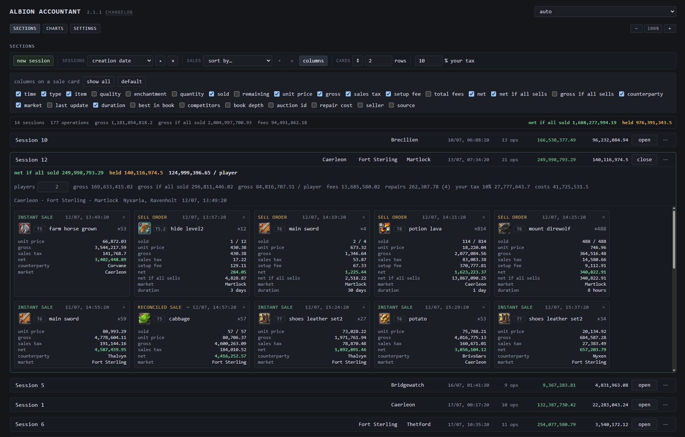
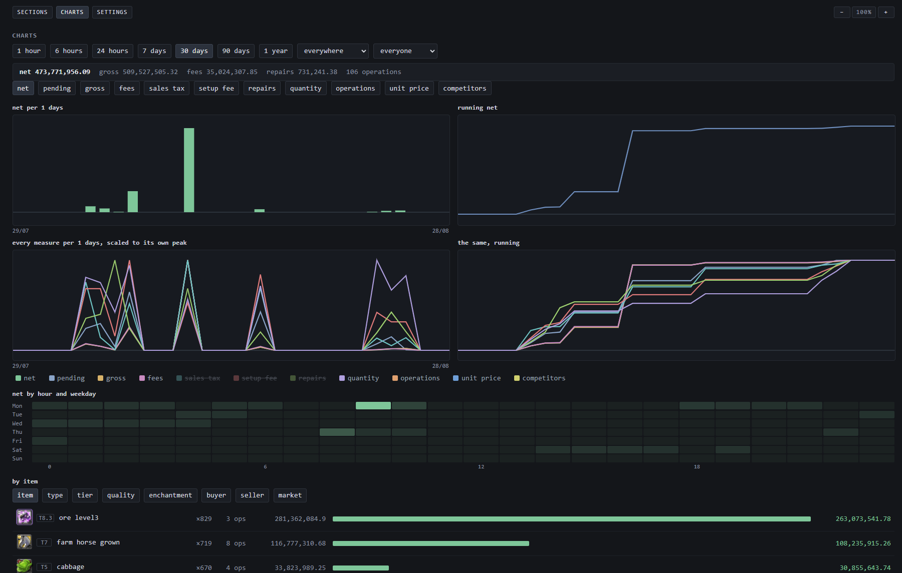
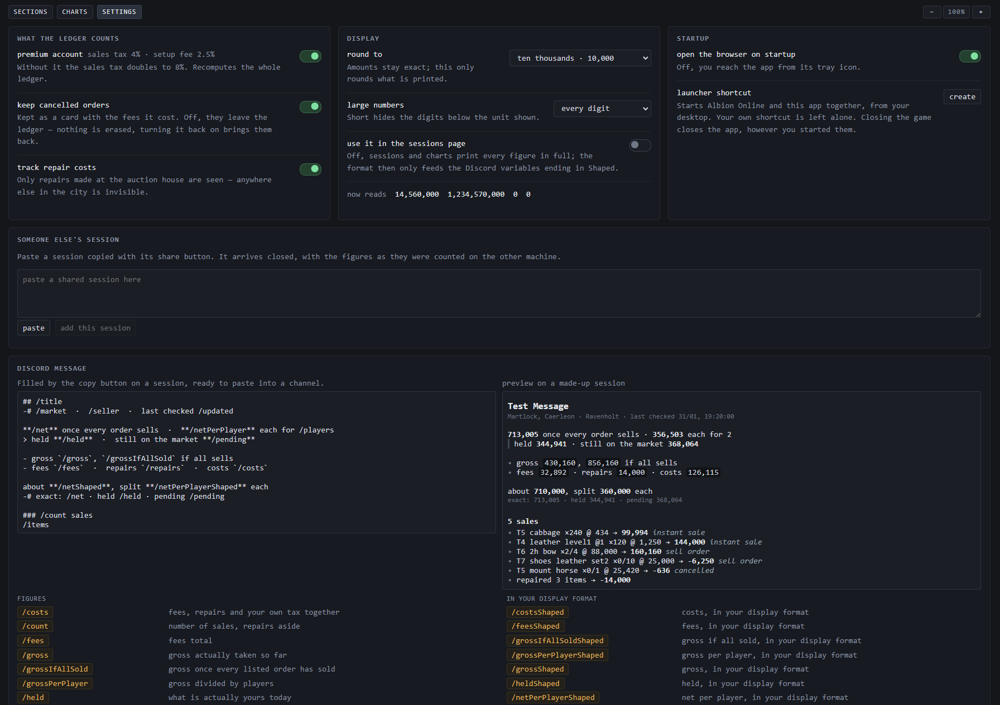

# Albion Accountant

Auction house accounting for Albion Online. It watches the game's own traffic and
keeps the books for what you sell: every sale with its real price, its tax, what it
actually brought in, and what is still waiting on the market.

No spreadsheet, no typing, no screenshots to read back.

## Install

Download the installer from the [latest release](https://github.com/tomlrd/Albion-Accountant-Client/releases/latest)
and run it. Nothing else is needed.

- **No window.** It lives in the tray and opens its pages in your browser.
- **Administrator rights**, asked at startup — reading the game's traffic needs them.
- **It only listens.** Nothing is ever sent to the game, and nothing leaves your machine.

## Sessions

A session is one run of trading. Open the auction house in game and your sales land in
the session you have open; close it when the run is over.

- **Every sale becomes a card** — unit price, gross, sales tax, setup fee, and the net
  that actually reached your purse.
- **Sell orders are followed over time.** How much has gone, what is left, what it will
  be worth once the rest sells, how long it stays listed.
- **Cancellations are seen, not guessed.** Cancel an order in game and the card says so,
  with the fees it cost you. You can also drop them from the books entirely.
- **Each sale keeps the market it was made in**, so a session that toured three cities
  says which ones.
- **The session line is the run at a glance** — what it will be worth once every order
  sells, what you already hold, what each player gets.
- **Take your own cut** with `% your tax`; it is deducted everywhere.
- **Arrange it your way** — choose the columns, sort the cards, fold a session to its
  title, drag a sale into another session.
- **Share a session as text**, or copy it as a message ready to paste into a channel.

## Charts

The same figures over time, from the last hour to the last year.

- **Pick a measure** — net, pending, gross, fees, sales tax, setup fee, repairs,
  quantity, operations, unit price, competitors — drawn per period and as a running total.
- **All measures at once** on a single scaled chart, to see them move against each other.
- **A heatmap of hours and weekdays**, for the question a timeline cannot answer: when is
  selling actually worth it.
- **Break the range down** by item, type, tier, quality, enchantment, buyer, seller or market.
- **Filter to one market or one seller**, which is what makes an imported session readable.

## Settings

- **Premium account** — it sets your sales tax, so the whole ledger follows it.
- **Repair costs** — count what repairing takes out of a session.
- **Cancelled orders** — keep them as cards, or drop them from the books.
- **Number format** — round the figures for reading, from hundredths up to millions, and
  show large numbers in full or as `14.6m`. The maths never changes, only the printing.
- **The Discord message** is yours to write, with a live preview beside the editor and
  thirty values to drop into it — each figure available exact or in your chosen format.
- **Someone else's session** — paste a session shared from another machine and it joins
  your list, counted exactly as it was there.
- **A launcher shortcut** that starts the game and the app together.

## Updates

The app checks for a new version when it starts and offers to install it. Your sessions
and your history are never touched by an update.

## Releases

This repository carries the releases. Every one of them lists what changed.
